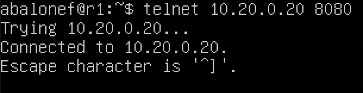

# DO2_LinuxNetwork

## Оглавление

1. [Инструмент ipcalc](#part-1-инструмент-ipcalc)
2. [Статическая маршрутизация между двумя машинами](#part-2-статическая-маршрутизация-между-двумя-машинами)
3. [Утилита iperf3](#part-3-утилита-iperf3)
4. [Сетевой экран](#part-4-сетевой-экран)
5. [Статическая маршрутизация сети](#part-5-статическая-маршрутизация-сети)
6. [Динамическая настройка IP с помощью DHCP](#part-6-динамическая-настройка-ip-с-помощью-dhcp)
7. [NAT](#part-7-nat)
8. [Допополнительно. Знакомство с SSH Tunnels](#part-8-дополнительно-знакомство-с-ssh-tunnels)

## Part 1. Инструмент ipcalc.

1. Сети и маски.
  * Адрес сети 192.167.38.54/13  
  Ответ: 192.160;
  * Перевод маски 255.255.255.0 в префиксную и двоичную запись, /15 в обычную и двоичную, 11111111.11111111.11111111.11110000 в обычную и префиксную  
  Обычная запись: 255.255.255.0;    
  Префиксная запись: /24;  
  Двоичная запись: 11111111.11111111.11111111.00000000;  

  Обычная запись: 255.254.0.0;    
  Префиксная запись: /15;  
  Двоичная запись: 11111111.11111110.00000000.00000000; 

  Обычная запись: 255.255.255.240;    
  Префиксная запись: /28;  
  Двоичная запись: 11111111.11111111.11111111.11110000;  

  * Минимальный и максимальный хост в сети 12.167.38.4 при масках: /8, 11111111.11111111.00000000.00000000, 255.255.254.0 и /4  
  /8: максимальный - 12.255.255.254, минимальный - 12.0.0.1;  
  11111111.11111111.00000000.00000000: максимальный - 12.167.255.254, минимальный - 12.167.0.1;  
  255.255.254.0: максимальный - 12.167.39.254, минимальный - 12.167.38.1;  
  /4: максимальный - 15.255.255.254, минимальный - 0.0.0.1;  

2. localhost
  * Определить и записать в отчёт, можно ли обратиться к приложению, работающему на localhost, со следующими IP: 194.34.23.100, 127.0.0.2, 127.1.0.1, 128.0.0.1  
  >localhost (127.0.0.1) является особенным среди IP-адресов. Как правило, IP-адрес является уникальным для каждого  компьютера как в локальной сети, так и в Интернете. 127.0.0.1, однако, всегда указывает на компьютер, который вы  используете в данный момент, несмотря ни на что.  
  >Диапазон адресов, зарезервированный под локальную сеть: 127.0.0.1 - 127.255.255.255`  
  Поскольку localhost можно определить только как ip адрес с началом в 127, то ответ: 127.0.0.2 и 127.1.0.1;  

3. Диапазоны и сегменты сетей
  * Какие из перечисленных IP можно использовать в качестве публичного, а какие только в качестве частных: 10.0.0.45, 134.43.0.2, 192.168.4.2, 172.20.250.4, 172.0.2.1, 192.172.0.1, 172.68.0.2, 172.16.255.255, 10.10.10.10, 192.169.168.1  
  >Приватный IP-адрес существует только в рамках локальной сети. Для компьютеров с приватным адресом невозможен обмен информацией или выход в Интернет без участия посредника – сервера или роутера.  
  >Публичный IP-адрес (его также называют «белым») используется в сети Интернет.  
  >Приватные адреса начинаются со следующих чисел -10, 127, 169, 172, 192. Все остальные IP относятся к публичным.  
  Приватные адреса: 10.0.0.45, 10.10.10.10, 192.168.4.2, 172.20.250.4, 172.0.2.1, 192.172.0.1, 172.68.0.2, 172.16.255.255, 192.169.168.1;  
  Публичный адрес: 134.43.0.2;  

  * Какие из перечисленных IP адресов шлюза возможны у сети 10.10.0.0/18: 10.0.0.1, 10.10.0.2, 10.10.10.10, 10.10.100.1, 10.10.1.255  
  >Как правило, адрес шлюза имеет ту же сетевую часть, что и адрес хост-компьютера, но в его машинной части стоит 1.  
  Ответ: 10.10.0.2;  

## Part 2. Статическая маршрутизация между двумя машинами.

* Вызов команды `ip a`:  
  ws1:  
    

* ws2:  
    

* Заданный ip-адрес `192.168.100.10/16` для ws1:  
    

* Заданный ip-адрес `172.24.116.8/12` для ws2:  
    

* Применение текущей конфигурации через `netplan apply`:  
  

1. Добавление статического маршрута вручную.  
Добавление маршрута через команду ip r add [адрес куда подключаемся] via [адрес шлюза(в нашем случае адрес откуда подключаемся)] dev [имя адаптера]  
C помощью команды `ip route s` отображаю текущие маршруты  

2. Добавление статического маршрута с сохранением.  
  * Добавляю статический маршрут от одной машины до другой с помощью файла etc/netplan/00-installer-config.yaml:  
  
  * Пингую соединение между машинами:  
  

## Part 3. Утилита iperf3

1. Скорость соединения.  
* 8 Mbps = 1MB/s  
* 100 MB/s = 819200Kbps
* 1 Gbps = 1024Mbps  

2. Утилита iperf3.  
>Консольная утилита iperf3 предназначена для того, чтобы измерять пропускную способность сети. Она поддерживает работу как по протоколу TCP, так и по UDP. Для проведения тестирования надо запустить iperf3 как на сервере, так и на клиенте. Клиентская часть будет генерировать трафик, а серверная - принимать и отбрасывать.  

  WS1 выступает в роли сервера, WS2 в роли клиента (флаги -s и -c соответственно). Для клиента дополнительно указывается ip-адрес хоста (откуда принимать сигнал)  
    
  **По итогам тестирования между машинами было передано 5.59 Гигабайт со скоростью 572 Мбайта/c**

## Part 4. Сетевой экран.
1. Утилита iptables.  
  >Iptables - это программа межсетевого экрана командной строки, которая разрешает или блокирует трафик на основе используемой цепочки политик. Iptables использует пакетный подход для мониторинга трафика. Когда программа пытается подключиться к вашей системе, iptables ищет правило из заранее определенного списка. Если правило не найдено, он возвращается к действию по умолчанию и предотвращает доступ к новому соединению.  
  >Используемые флаги:  
  >-A добавляет правило;  
  >-p выбор протокола;  
  >--dport выбор порта;  
  >-j выбор действия(ACCEPT/REJECT/DROP);  
  * Создаю файлы firewall.sh и прописываю правила:  
      
    
    >Так как нам нужно заблокировать ping, а эта утилита работает по протоколу icmp, с флагом -p прописываю icmp   

  * Запускаю их:  
      
  **На машине w1 мы сначала запрещаем пинг, а затем разрешаем, поэтому машина будет отвечать на запросы. В случае с машиной w2 по итогу мы запретили передачу, поэтому пинговаться она не будет. Это подтверждается командой ping в следующем пункте.**

2. Утилита nmap.  
  * Команда `ping`:  
      
  * Команда `nmap`:  
    >Nmap — это инструмент командной строки Linux для исследования сети и аудита безопасности. Одной из особенностей nmap является то, что эта утилита может определить, включен ли хост, даже если его нельзя пропинговать.  

      

## Part 5. Статическая маршрутизация сети.

1. Статическая маршрутизация сети.  
  * Настройка конфигурации каждой из машин:  
    ws11:  
      
    ws21:  
      
    ws22:  
      
    r1:  
      
    r2:  
      
  * Команды `ping` и `ip -4 a`
    ws11 `ip -4 a` и `ping` с r1:  
      
    ws21 `ip -4 a` и `ping` с ws22:  
      
    ws22 `ip -4 a` и `ping` с ws21:  
      
    r1 `ip -4 a` и `ping` с ws11:  
      
    r2 `ip -4 a`:  
        
2. Включение переадресации IP-адресов.  
  * команда `sysctl -w net.ipv4.ip_forward=1` для r1:  
      
  * команда `sysctl -w net.ipv4.ip_forward=1` для r2:  
      
  * файл /etc/sysctl.conf для r1:  
      
  * команда /etc/sysctl.conf для r2:  
      
3. Установка маршрута по-умолчанию.  
  * Файлы конфигурации:  
    ws11:  
      
    ws21:  
      
    ws22:  
      
    **Для роутеров также необходимо задать шлюз, чтобы данные пересылались между сетями**  
    r1:  
      
    r2:  
      
  * команда `ip r`:  
      
  * Пингую с ws11 роутер r2:  
      
4. Добавление статических маршрутов.  
  * Добавляю в роутеры r1 и r2 статические маршруты в файле конфигураций.
    r1:  
      
    r2:  
    
  * Таблицы с маршрутами r1 и r2:  
    
  * ip r list 10.10.0.0/18 и ip r list 0.0.0.0/0  
    
    **Маршрут по умолчанию имеет более низкий приоритет и срабатывает, когда не найден подходящий маршрут в таблице маршрутизации. Для сети 10.10.0.0 было создано правило, соответственно используется созданный маршрут.**
5. Построение списка маршрутизаторов.  
  Cписок маршрутизаторов на пути ws11 до ws21 + `tcpdump -tnv -i` на r1:  
    
  >Каждый пакет проходит на своем пути определенное количество узлов, пока достигнет своей цели. Причем, каждый пакет имеет свое время жизни. Это количество узлов, которые может пройти пакет перед тем, как он будет уничтожен. Этот параметр записывается в заголовке TTL, каждый маршрутизатор, через который будет проходить пакет уменьшает его на единицу. При TTL=0 пакет уничтожается, а отправителю отсылается сообщение Time Exceeded.

  >Команда traceroute linux использует UDP пакеты. Она отправляет пакет с TTL=1 и смотрит адрес ответившего узла, дальше TTL=2, TTL=3 и так пока не достигнет цели. Каждый раз отправляется по три пакета и для каждого из них измеряется время прохождения. Пакет отправляется на случайный порт, который, скорее всего, не занят. Когда утилита traceroute получает сообщение от целевого узла о том, что порт недоступен трассировка считается завершенной.  
6. Использование протокола ICMP при маршрутизации.  
  * на роутере r1 перехват сетевого трафика с помощью `tcpdump -n -i eth0 icmp`, а на машине ws11 пинг несуществующего ip  
  

## Part 6. Динамическая настройка IP с помощью DHCP.
  * Настройка DHCP на r2 в файле /etc/dhcp/dhcpd.conf:  
      
    Файл resolf.conf:  
      
  * Перезагрузить службу DHCP командой systemctl restart isc-dhcp-server. Машину ws21 перезагрузить при помощи reboot и через ip a показать, что она получила адрес. Также пропинговать ws22 с ws21.  
      
    `ip a` на ws21:  
      
    ping ws22 с ws21:  
      
  * Указать MAC адрес у ws11 в etc/netplan/00-installer-config.yaml:  
      
    **Для корректной работы лучше использовать mac адрес из visualbox (у меня это 08:00:27:8c:1b:55)**
  * Настройка DHCP на r1 в файле /etc/dhcp/dhcpd.conf:  
    Файл /etc/dhcp/dhcpd.conf с дополнительным модулем для привязки ws11 всегда одному ip адресу  
      
  * Запросить с ws21 обновление ip адреса:  
    До обновления:  
      
    После обновления:  
      
    Для этого трюка я использовал команды:  
    `sudo dhclient -r enp0s8` - очищает все параметры интерфейса  
    `sudo dhclient enp0s8` - обновляет все параметры, запрашивая их у DHCP сервера  

  ## Part 7. NAT
  * В файле /etc/apache2/ports.conf на ws22 и r1 изменить строку Listen 80 на Listen 0.0.0.0:80, то есть сделать сервер Apache2 общедоступным:  
      
      
  * Запуск Apache на w22 и r1:  
      
      
  * Создание файервола на r2:
      
    ping с w22 на r1 (благодаря файерволу на r2 не пингуется):  
      
  * Разрешить маршрутизацию всех пакетов протокола ICMP:  
      
    ping с w22 на r1 (пингуется):  
      
  * Включить SNAT, а именно маскирование всех локальных ip из локальной сети, находящейся за r2 (по обозначениям из Части 5 - сеть 10.20.0.0) и Включить DNAT на 8080 порт машины r2 и добавить к веб-серверу Apache, запущенному на ws22, доступ извне сети  
  >SNAT - Source Network Address Translation - изменение адреса и порта источника пакета, доступен в цепочке POSTROUTING  
  >DNAT - Destination Network Address Translation - изменение адреса и порта назначения пакета, доступен в цепочках PREROUTING и OUTPUT  
  >Более подробное знакомство мы начнем со SNAT, как мы уже говорили выше данное действие изменяет адрес и порт источника пакета, одно из основных практический применений - обеспечения доступа локальной сети в интернет. Давайте посмотрим, в чем состоит проблема и как SNAT помогает ее решить. Для использования в локальных сетях используются диапазоны частных или т.н. "серых" IP-адресов, их особенностью является то, что они не маршрутизируются в интернете, т.е. если маршрутизатору попадает такой пакет и для него нет отдельного маршрута - он будет отброшен. При этом внешний адрес у данной сети один и его как-то следует использовать для обращения к внешнему миру всех локальных ПК.  
  >Что делает SNAT? Он заменяет адрес источника пакета внешним адресом, также, при необходимости, меняет и порт источника, что позволяет различать запросы, сделанные с одного и того же порта разных ПК, запись о выполненной трансляции заносится в специальную таблицу трансляций (она же таблица NAT). Получив ответ роутер находит запись в таблице трансляций и на ее основании изменяет адрес и порт назначения ответного пакета, после чего он прозрачно доставляется адресату в локальной сети.  
  >Второе основное действие в таблице nat - это DNAT - или изменения адреса и порта назначения пакета. Это действие применимо в цепочках PREROUTING и OUTPUT, т.е. на самом входе в брандмауэр, раньше таблицы nat пакеты попадают только в mangle. На практике DNAT применяется в основном для проброса портов  

      

  >ключ `-t`, который указывает используемую таблицу, если данный ключ не указан, то по умолчанию используется таблица filter;  
  >запись добавляется в цепочку `POSTROUTING`;  
  >критерий `-o enp0s8`, т.е. использующий в качестве исходящего внешний интерфейс enp0s8;  
  >критерий `-i enp0s9`, т.е. использующий в качестве входящего внешний интерфейс enp0s9;  
  >флаг `-s` это диапазон адресов для преобразования, чтобы не изменять все исходящие пакеты без разбору;  
  >для SNAT обязательно указывается параметр `--to-source`, который используется для указания адреса, присваиваемому пакету, теперь именно этот адрес будет указываться в качестве исходящего.  
  >флаг `-p` указание конкретного протокола (обязательно для DNAT);  
  >флаг `--dport` указание порта назначения tcp сегмента (обязательно для DNAT);  
  >флаг `--to-destination` адрес внутреннего сервера (обязательно для DNAT), для изменения порта в конце добавляется порт;  

  * Проверить соединение по TCP для SNAT, для этого с ws22 подключиться к серверу Apache на r1 командой:  
      
  * Проверить соединение по TCP для DNAT, для этого с r1 подключиться к серверу Apache на ws22 командой telnet (обращаться по адресу r2 и порту 8080)  
      
## Part 8. Дополнительно. Знакомство с SSH Tunnels  
  * Запустить на r2 фаервол с правилами из Части 7:  
      
  * Запустить веб-сервер Apache на ws22 только на localhost (то есть в файле /etc/apache2/ports.conf изменить строку Listen 80 на Listen localhost:80):  
      
  * Воспользоваться Local TCP forwarding с ws21 до ws22, чтобы получить доступ к веб-серверу на ws22 с ws21:  
      
    >На машине ws21 по порту 9999 подключаемся к apache2 серверу (работает на 80 порте) на ws22, который расположен по адресу 10.20.0.20 на учётке abalonef. По итогу имеем доступ к машине ws22 под учёткой abalonef.  

    >Другое объяснение: После успешного подключения к SSH-серверу на «ws22», на «ws21» SSH-клиент начинает слушать порт 9999. При подключении к порту 9999 на «ws21», SSH-сервер на «ws22» устанавливает соединение с localhost (коим и является для себя самого «ws22») на порт 80 и передает по этому соединению данные, принятые ssh-клиентом на «ws1» на порт 9999.  

    Для проверки подключаемся во втором терминале ws21 через telnet используя порт, с которым подключились по ssh(9999):  
      
  * Воспользоваться Remote TCP forwarding c ws11 до ws22, чтобы получить доступ к веб-серверу на ws22 с ws11:  
      
    >После успешного подключения, на «ws11» SSH-сервер начинает слушать порт 9999. При подключении к порту 9999 на «ws11», SSH-клиент на «ws22» устанавливает соединение с localhost (коим и является для себя самого «ws22») на порт 80 и передает по этому соединению данные, принятые ssh-сервером на «ws11» на порт 9999.  

      
