EADME# LinuxMonitoring v2.0

1. [Генератор файлов](#part-1-генератор-файлов)  
2. [Засорение файловой системы](#part-2-засорение-файловой-системы)  
3. [Очистка файловой системы](#part-3-очистка-файловой-системы)  
4. [Генератор логов](#part-4-генератор-логов)  
5. [Мониторинг](#part-5-мониторинг)  
6. [GoAccess](#part-6-goaccess)  
7. [Prometheus и Grafana](#part-7-prometheus-и-grafana)  
8. [Готовый дашборд](#part-8-готовый-дашборд)  
9. [Дополнительно. Свой node_exporter](#part-9-дополнительно-свой-node_exporter)  

## Part 0. SSH Remote с виртуальной машины

1. Настройка ssh на виртуальной машине  
`sudo apt-get install openssh-server` - установка open-ssh  
`sudo systemctl enable ssh` - активация ssh  
`sudo systemctl start ssh` - запуск сервиса ssh  

2. Проброс портов в VirtualBox  
**Host port** - порт на машине, с которой подключаемся  
**Guest port** - порт на на виртуальной машине (за которым закреплён ssh)  
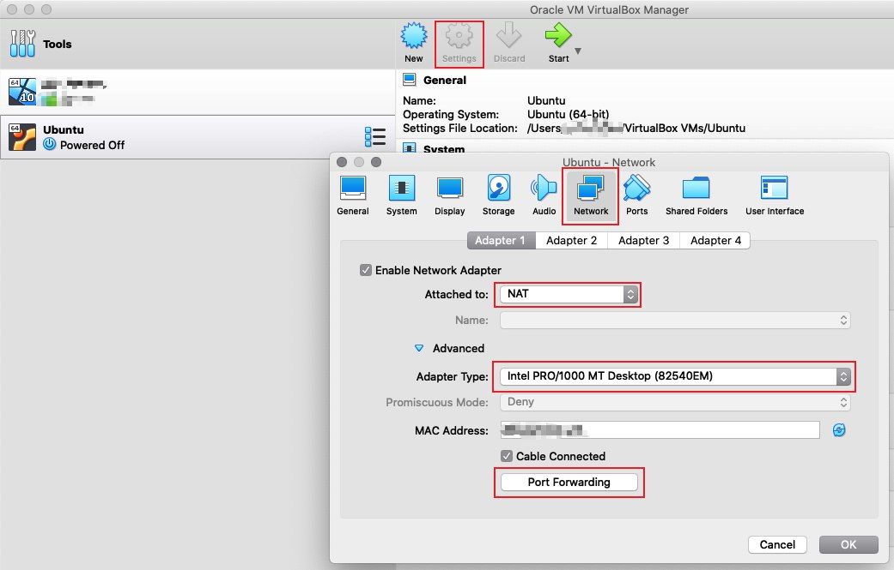  
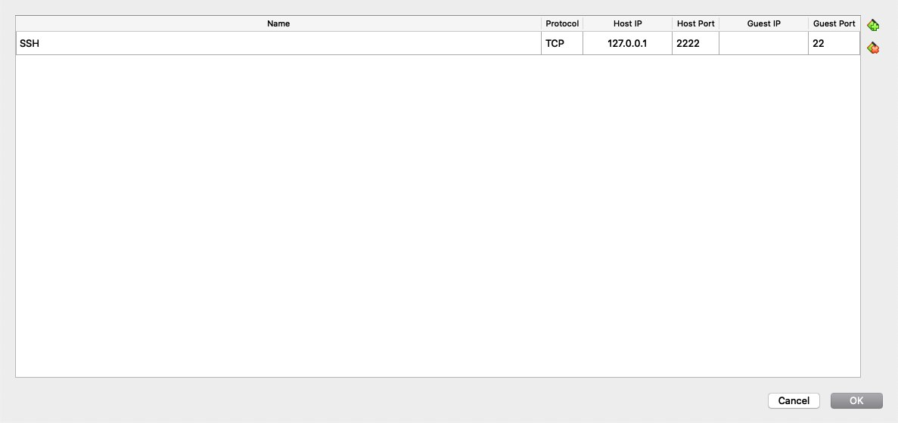  

3. Подключение
`ssh user_name@127.0.0.1 -p 2222` 

## Part 1. File generator

Скрипт создал в директории '/home/marcus/test' 4 папки, в каждой из них по 5 файлов весом *3 Kb*:  
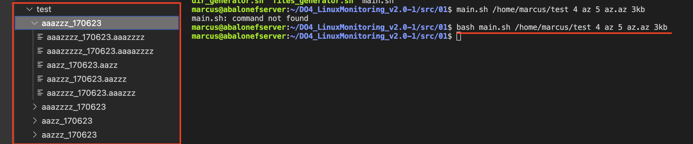  
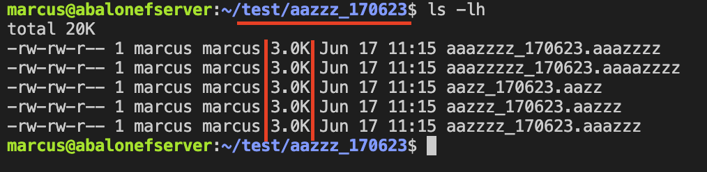  

## Part 2. File system clogging

Скрипт засорил систему файлами по 100 Мб, оставив ~1Гб свободного места:  
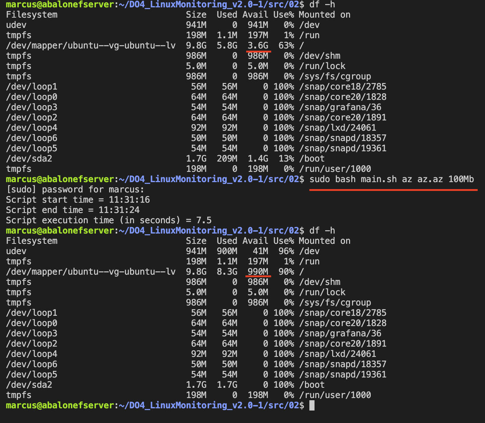  
**logfile.log:**  
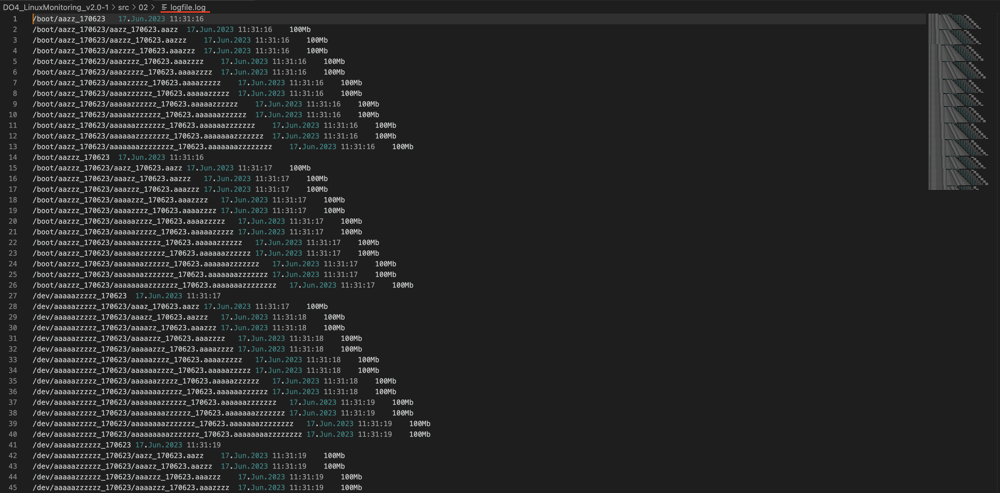  

## Part 3. Cleaning the file system

Скрипт очищает систему от файлов предыдущего задания тремя способами:  

1. По лог-файлу предыдущего задания  
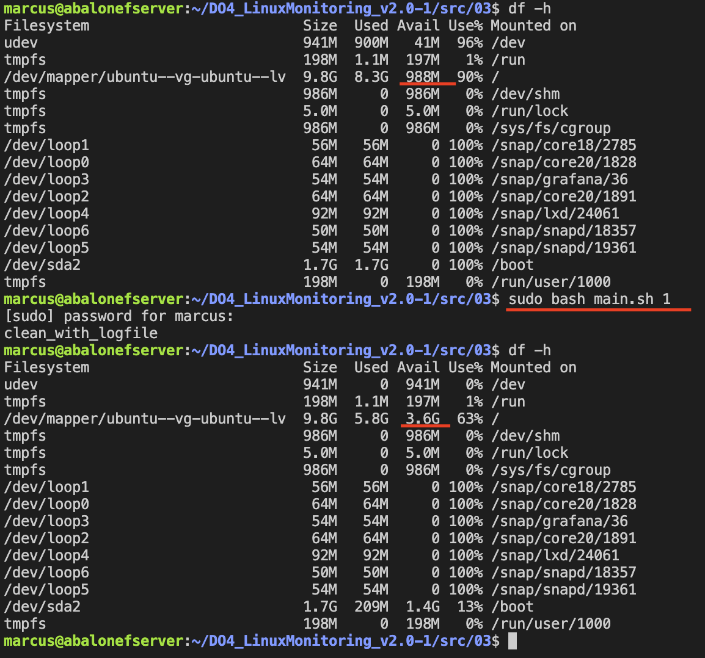  

2. По дате создания файлов
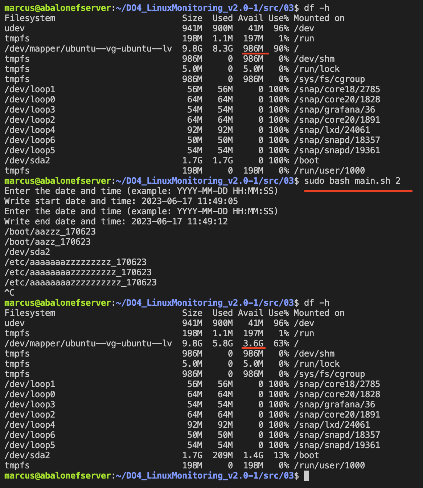  

3. По маске
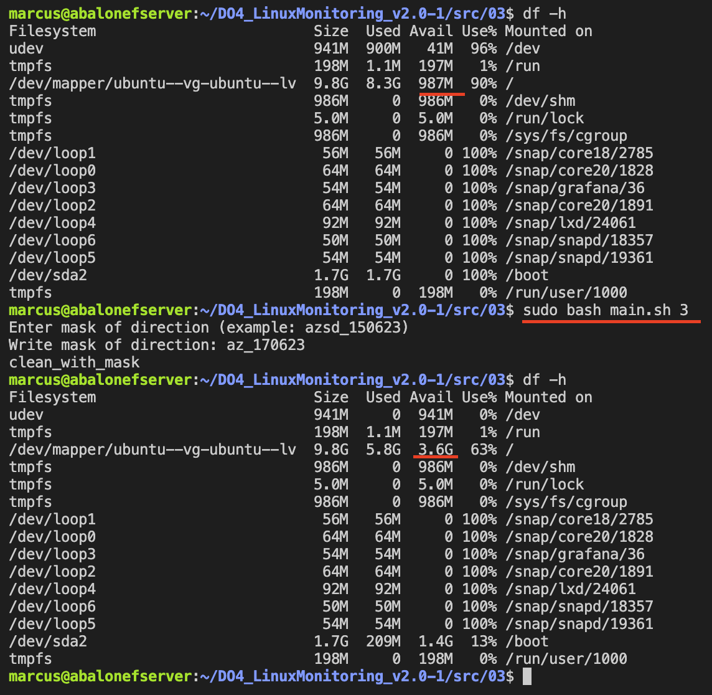  

## Part 4. Log generator

Скрипт создаёт пять логфайлов со случайными значениями (в папке logs):  
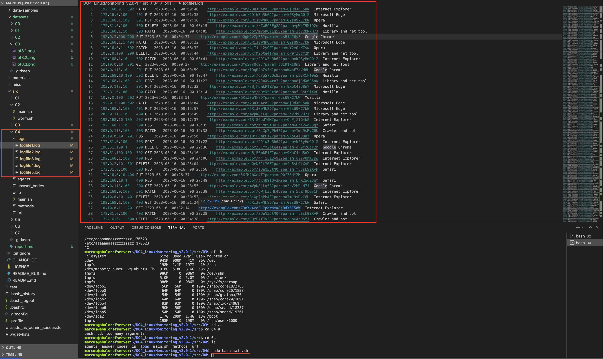  

## Part 5. Monitoring

Скрипт выполняет сортировку всех логов из предыдущего задания и записывает результат в файл output:  

1. Все записи, отсортированные по коду ответа
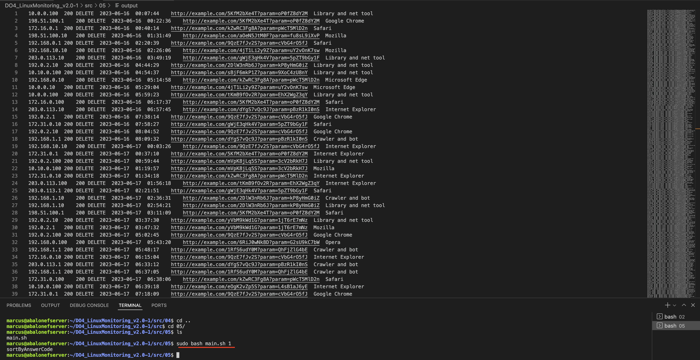  
2. Все уникальные IP, встречающиеся в записях
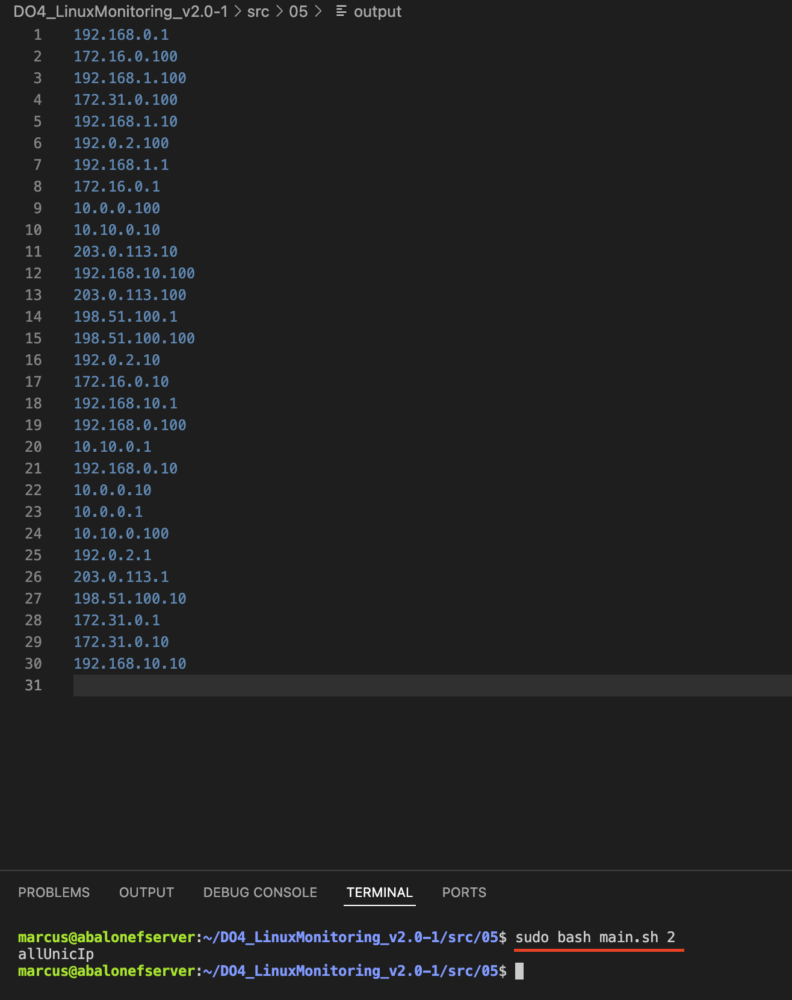  
3. Все запросы с ошибками (код ответа - 4хх или 5хх)
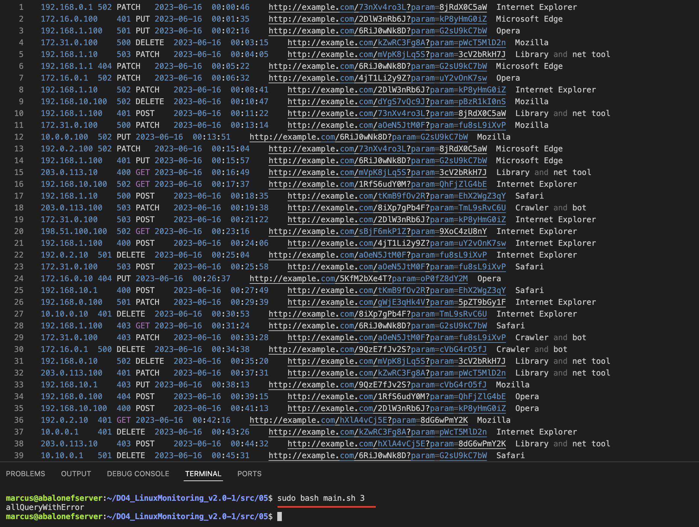  
4. Все уникальные IP, которые встречаются среди ошибочных запросов
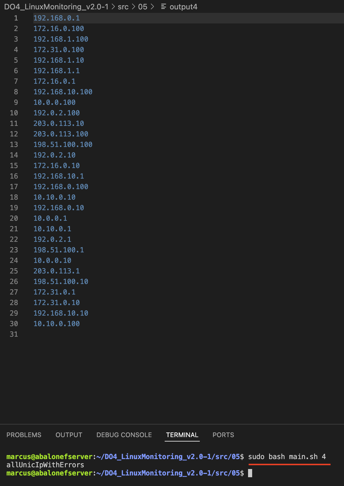  

## Part 6. GoAccess

Скрипт запускает утилиту GoAccess и выводит результат в терминал (если система не имеет графического интерфейса) или создаёт index.html (если графический интерфейс есть)  
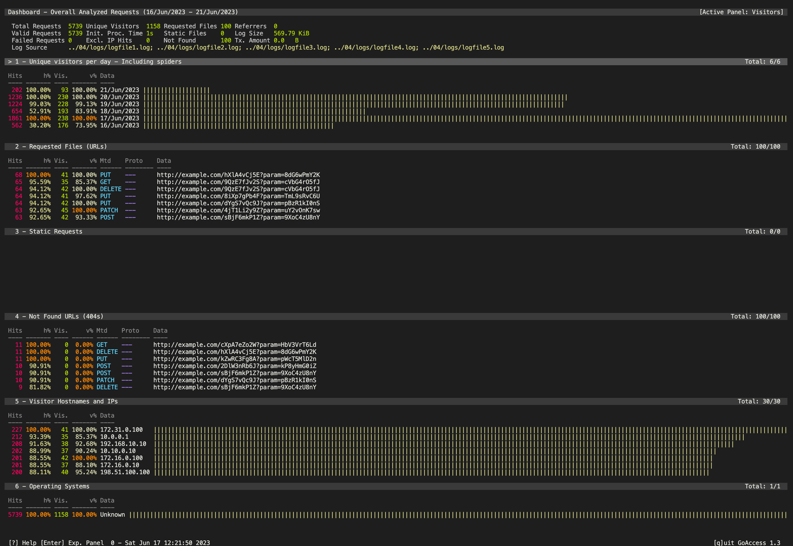  

## Part 7. Prometheus и Grafana

* Установка Grafana  
Grafana является графической оболочкой для отображения данных с Prometheus  
`sudo apt-get install -y adduser libfontconfig1 && wget https://dl.grafana.com/oss/release/grafana_10.0.0_amd64.deb && sudo dpkg -i grafana_10.0.0_amd64.deb`  

`sudo systemctl enable grafana-server` - старт графаны при загрузке системы  
`sudo systemctl start grafana-server` - старт графана  
`ufw allow 3000/tcp` - открываем 3000 порт, на котором работает графана  
`sudo systemctl status grafana-server` - проверка статуса графаны  
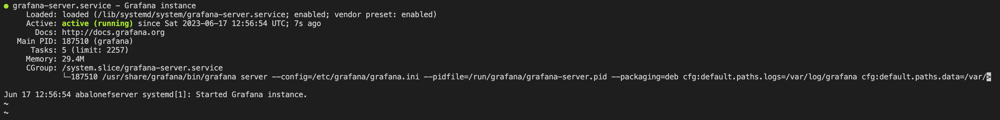

* Установка Prometheus  
Prometheus метрики от экспортеров и сохраняет их в БД.  
`sudo apt-install prometheus`  - установка  
`adduser --no-create-home --disabled-login --shell /bin/false --gecos "Prometheus Monitoring User" prometheus` - добавление пользователя для Prometheus  
`mkdir -p /opt/data/prometheus && mkdir -p /opt/configs/` - создаем директории для хранения данных и конфигурации  
`chown -R prometheus:prometheus /opt/data/prometheus` - добавляем права на директорию где будут хранится данные  
`sudo nano /etc/systemd/system/prometheus.service` - добавляем файл сервиса и прописываем следующим образом:  
>[Unit]  
>Description=Prometheus  
>Wants=network-online.target  
>After=network-online.target  
>
>[Service]  
>User=prometheus  
>Group=prometheus  
>Type=simple  
>ExecStart=/usr/local/bin/prometheus \  
>   --config.file /opt/configs/prometheus.yml \  
>    --storage.tsdb.path /opt/data/prometheus/ \  
>    --web.enable-admin-api --web.enable-lifecycle \  
>    --web.console.templates=/opt/prometheus/consoles \  
>    --web.console.libraries=/opt/prometheus/console_libraries \  
>    --storage.tsdb.retention.time=180d \  
>    --web.listen-address=0.0.0.0:9200  
>
>[Install]  
>WantedBy=multi-user.target  

В разделе *Service* прописывается пользователь, расположение утилиты и основные настройки (например web.listen-address=0.0.0.0:9200 - prometheus будет работать на порте 9200)  
`sudo nano /opt/configs/prometheus.yml` - создаём конфигурационный файл и запалняем его:  
>global:  
>  scrape_interval: 30s  
>  scrape_timeout: 10s  
>  evaluation_interval: 20s  
>scrape_configs:  
>  - job_name: node-exporter  
>    honor_labels: true  
>    scrape_interval: 15s  
>    scrape_timeout: 5s  
>    metrics_path: /metrics  
>    static_configs:  
>      - targets:  
>        - 127.0.0.1:9090  

В конфигурационном файле настраиваются параметры сбора метрик, в разделе scrape_configs указываются экспортеры метрик (в нашем случае node_exporter, который работает на 9090 порте)  
`sudo systemctl enable prometheus` - старт прометеуса при загрузке системы  
`sudo systemctl start prometheus` - старт прометеуса  
`sudo systemctl status prometheus` - проверка статуса прометеуса  
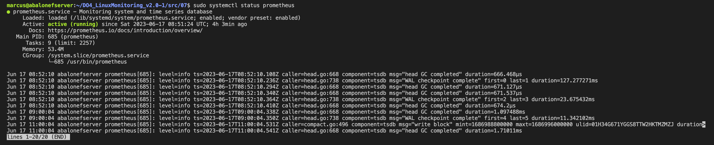

* Установка Node Exporter  
Node Exporter является экспортёром, собирает данные о сервере и возвращает их в виде набора метрик.  

`adduser --no-create-home --disabled-login --shell /bin/false --gecos "Node Exporter User" node_exporter` - добавление пользователя для node_exporter  
`wget https://github.com/prometheus/node_exporter/releases/download/v1.3.1/node_exporter-1.3.1.linux-amd64.tar.gz` - скачиваем архив с node_exporter  
`tar -xvf node_exporter-1.3.1.linux-amd64.tar.gz` - распаковываем  
`sudo mv node_exporter-1.3.1.linux-amd64/node_exporter /usr/local/bin/` - перемещаем в /usr/local/bin/  
`sudo nano /etc/systemd/system/node_exporter.service` - настраиваем файл сервиса:  
>[Unit]  
>Description=Node Exporter  
>Wants=network-online.target  
>After=network-online.target  
>  
>StartLimitIntervalSec=500  
>StartLimitBurst=5  
>  
>[Service]  
>User=node_exporter  
>Group=node_exporter  
>Type=simple  
>Restart=on-failure  
>RestartSec=5s  
>ExecStart=/usr/local/bin/node_exporter \  
>    --collector.logind \  
>    --web.listen-address=":9090"  
>  
>[Install]  
>WantedBy=multi-user.target  

В разделе *Service* прописывается пользователь, расположение утилиты и основные настройки (например web.listen-address=0.0.0.0:9090 - node_exporter будет работать на порте 9090)  
`sudo systemctl enable grafana-server` - старт grafana при загрузке системы  
`sudo systemctl start grafana-server` - старт grafana 
`sudo systemctl status grafana-server` - проверка статуса grafana  
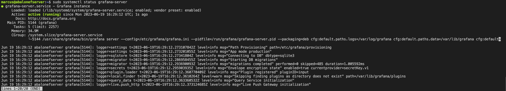  

* Получение доступа к веб интерфейсам Prometheus и Grafana с локальной машины  
Для этого пробросим порты в VirtualBox для сервисов Prometheus, Grafana и Node_exporter:  
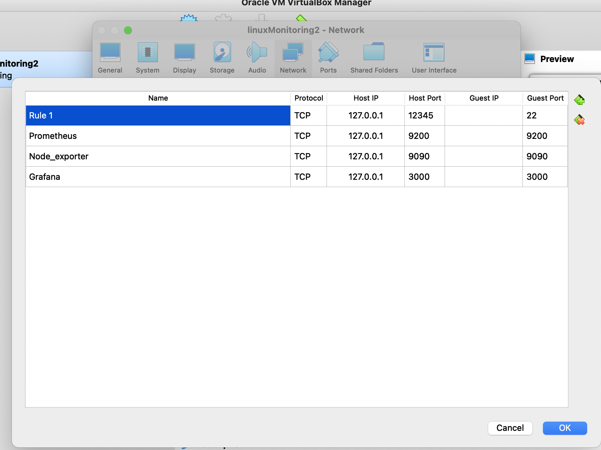  
Теперь они доступны в браузере по адресу localhost:port.  

* Добавил на дашборд Grafana отображение ЦПУ, доступной оперативной памяти, свободное место и кол-во операций ввода/вывода на жестком диске  
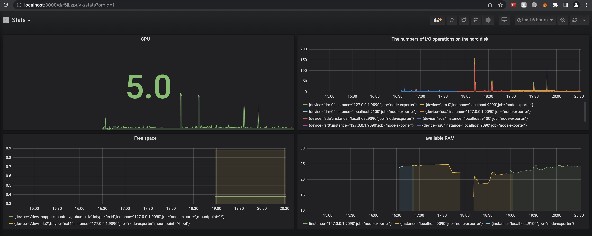  

* Запустить ваш bash-скрипт из Part 2
Произошла нагрузка на сервер:  
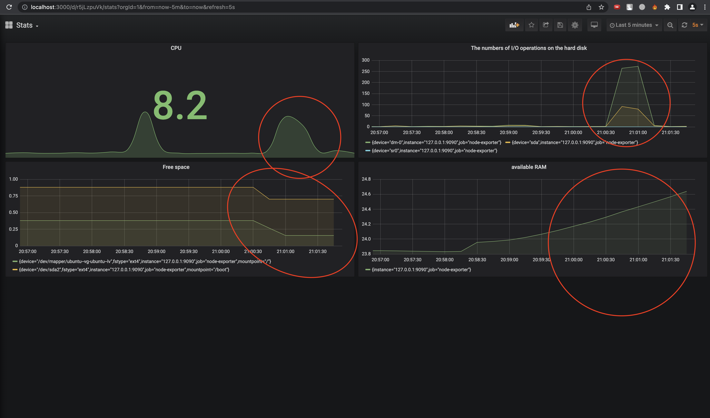  

* Установить утилиту stress и запустить команду `stress -c 2 -i 1 -m 1 --vm-bytes 32M -t 10s`  
Выполнение команды:  
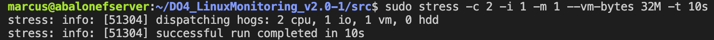  
Произошла нагрузка на сервер:  
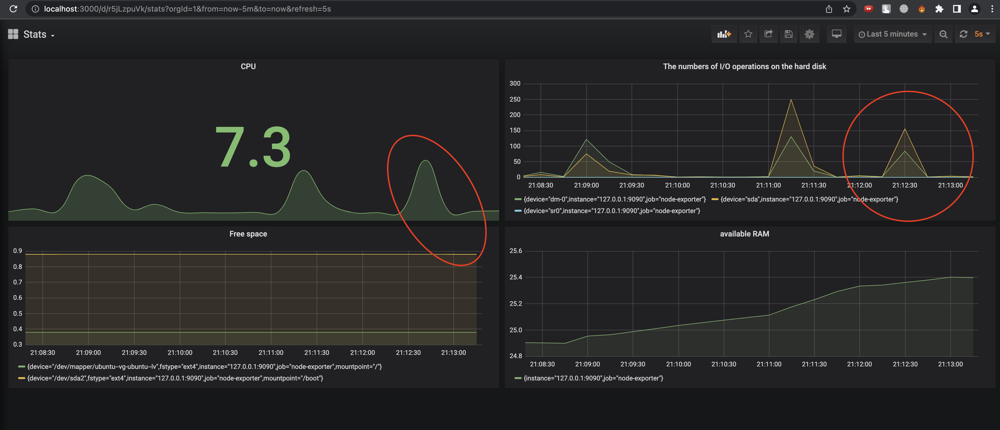  

## Part 8. A ready-made dashboard
* Готовый дашборд `Node Exporter Quickstart and Dashboard` скачен и настроен:  
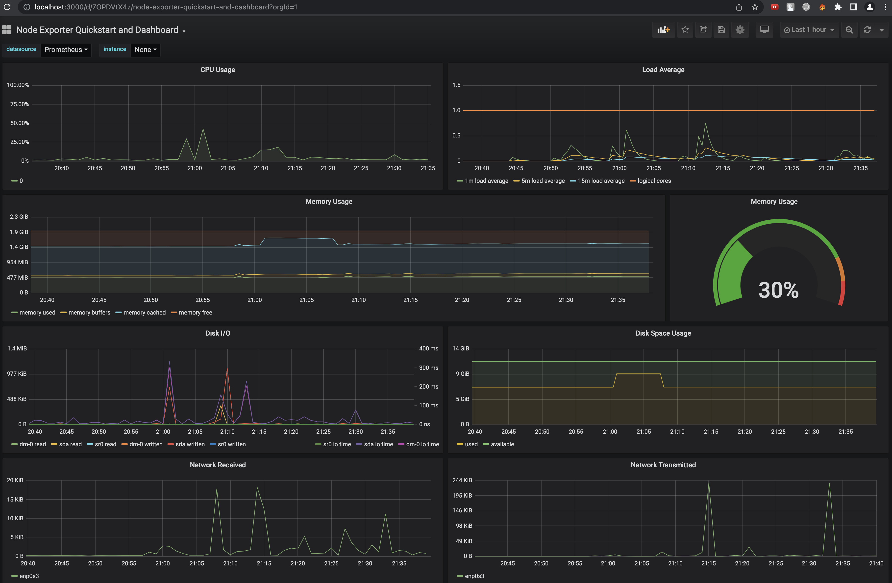  

* Запустить ваш bash-скрипт из Part 2  
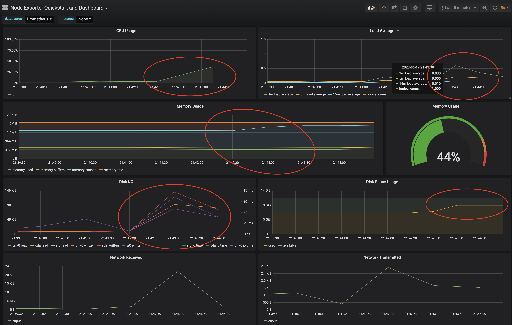  

* Установить утилиту stress и запустить команду `stress -c 2 -i 1 -m 1 --vm-bytes 32M -t 10s`  
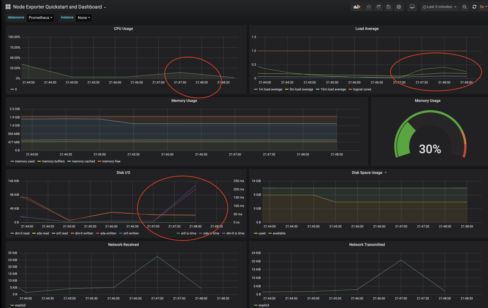  

* Создать ещё одну виртуалку и пробросить статическое соединение  
Создана локальная сеть, двум компьютерам присвоены ip *192.168.100.10* и *172.24.116.8* через адаптер **enp0s8**
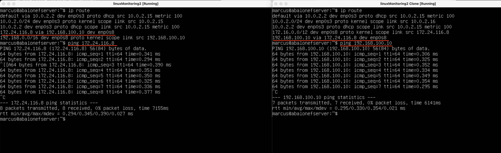  

* Через утилиту **iperf3** проведён тест сетевого соединения
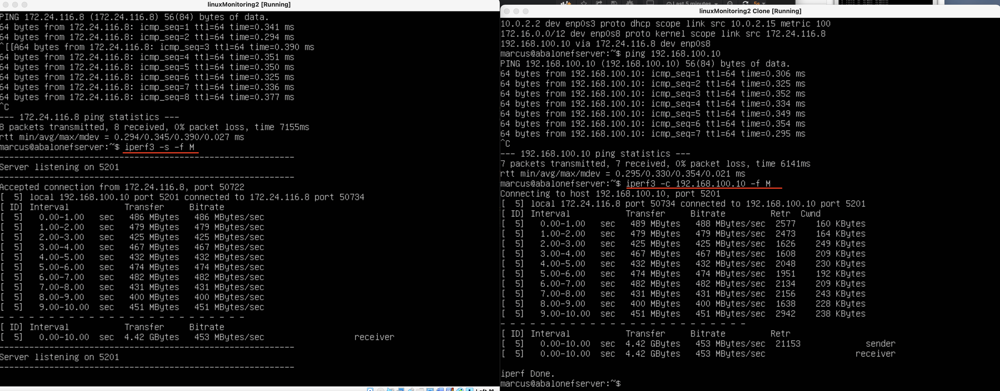  
**Результат видно в Графане:**  
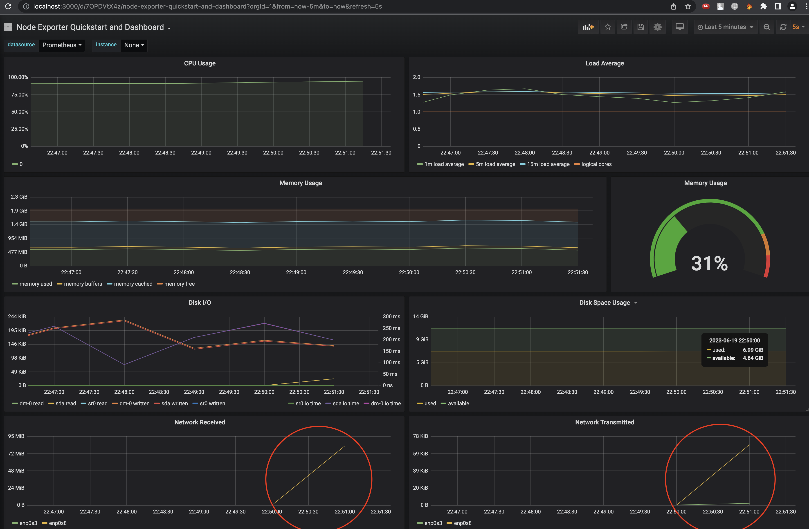  

## Part 9. Your own node_exporter.

*Структура файла с метриками node_exporter:*  
>\# HELP metric_name Metric description  
>\# TYPE metric_name metric_type  
>metric_name{label1="value1", label2="value2"} metric_value  

`metric_name` - имя метрики.  
`Metric description` - описание метрики.  
`metric_type` - тип метрики (например, counter, gauge, histogram, summary).  
`label1, label2` - метки (теги) метрики.  
`value1, value2` - значения меток метрики.  
`metric_value` - числовое значение метрики.  

* Настройка nginx.conf  
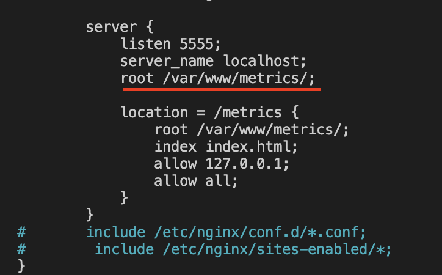  

* Перестройка конфигурационного файла prometheus.yml  
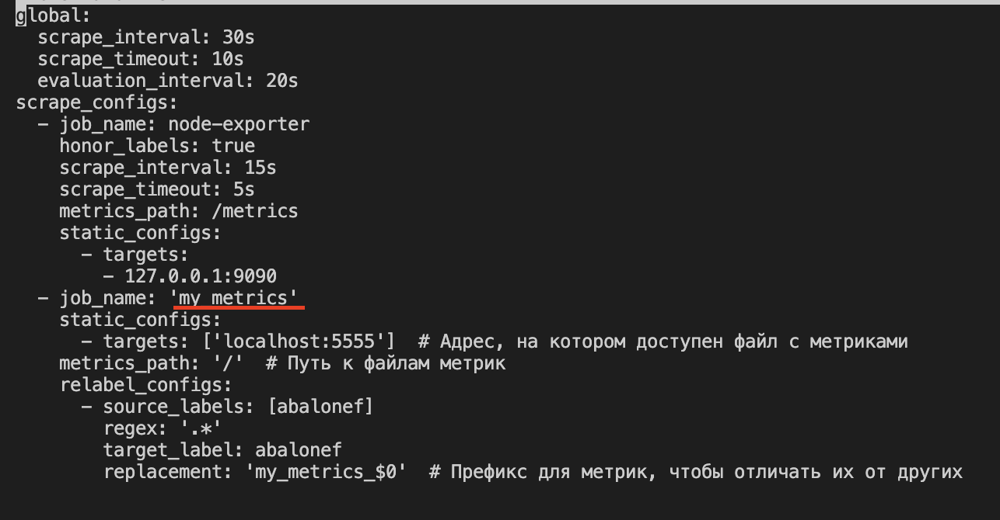  

* В Prometheus добавились мои метрики  
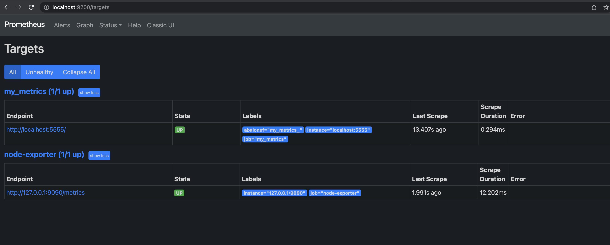  

* Нагрузка bash-скрипта из Part 2  
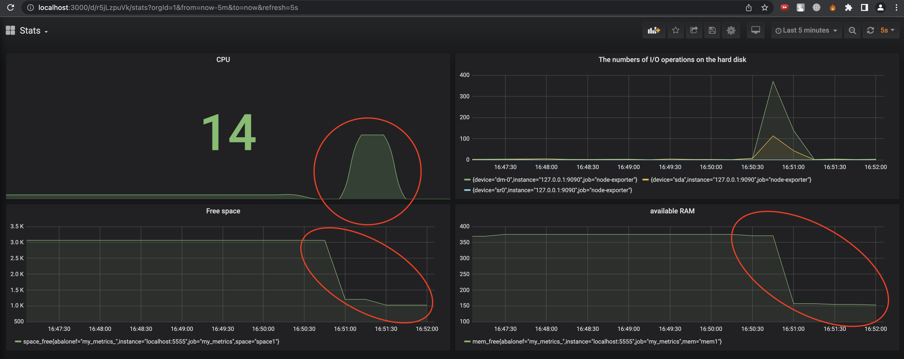  

* Нагрузка stress  
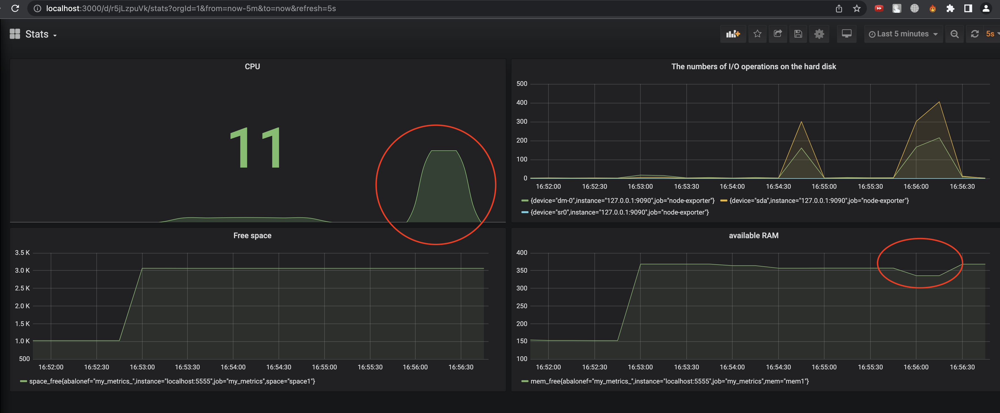  

